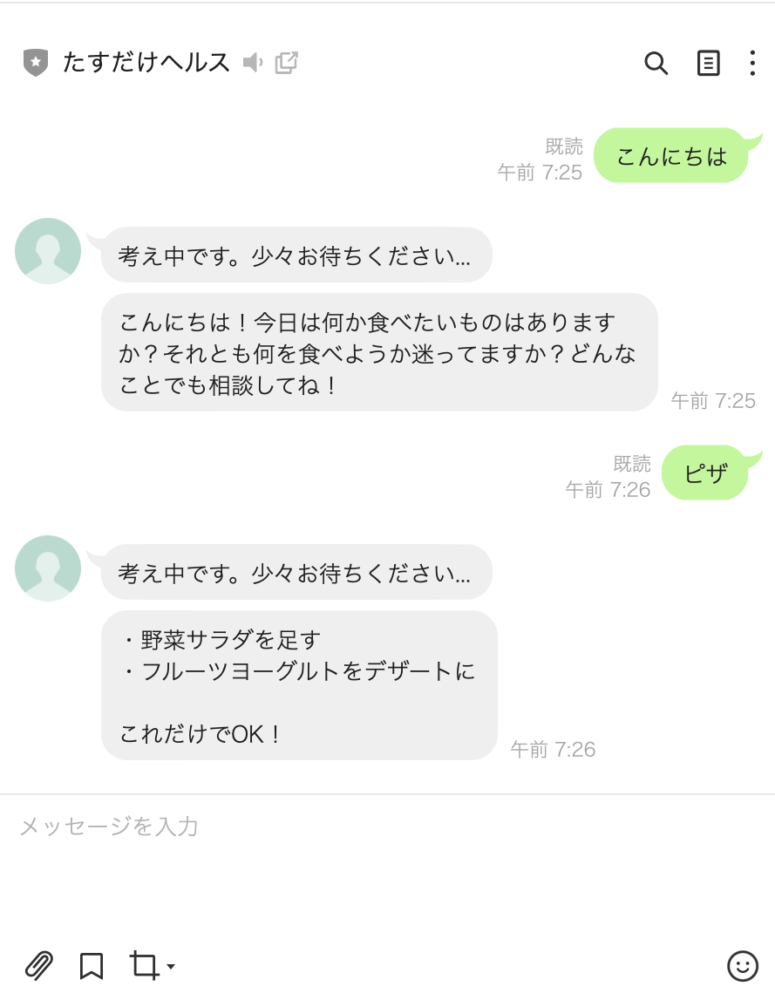

# たすだけヘルス

一人暮らしで栄養や健康を気にしたいけど、管理や計算はめんどくさい人のための「足すだけ・選ぶだけ」健康サポート LINE Bot。

食べたものを送るだけで、AIが「何を足せばバランスが取れるか」を提案してくれます。

## デモ

LINE Botとして動作します。友だち追加後、食事内容を送るだけで使えます。



## 機能

- 食べたものをテキストで送信するだけでAIが栄養バランスをフィードバック
- 「何を足せばいいか」を具体的・簡単に提案（コンビニで買えるものなど）
- Dify で構築したプロンプトにより、押しつけがましくない自然な返答

## 技術スタック

| 技術 | 用途 |
|------|------|
| Python / FastAPI | Webhookサーバー |
| LINE Messaging API | ユーザーとのやり取り |
| Dify API | AIによる栄養フィードバック生成 |
| Render | サーバーデプロイ |

## ファイル構成

```
health-chatbot/
├── main.py              # FastAPI Webhookサーバー
├── requirements.txt     # 依存パッケージ
├── render.yaml          # Renderデプロイ設定
└── README.md
```

## アーキテクチャ

```
LINEアプリ
    ↓ メッセージ送信
LINE Messaging API
    ↓ Webhook POST
FastAPIサーバー（Render）
    ↓ ユーザーメッセージ
Dify API
    ↓ AI回答
LINE Push Message API
    ↓ 返信
LINEアプリ
```

## セットアップ

### 必要なもの

- LINE Developers アカウント（Messaging API チャネル）
- Dify アカウント（チャットボットアプリ）
- Render アカウント（デプロイ先）

### 環境変数

| キー | 説明 |
|------|------|
| `LINE_CHANNEL_ACCESS_TOKEN` | LINE チャネルアクセストークン |
| `LINE_CHANNEL_SECRET` | LINE チャネルシークレット |
| `DIFY_API_KEY` | Dify API キー |

### ローカル起動

```bash
pip install -r requirements.txt
```

`.env` ファイルを作成して環境変数を設定：

```
LINE_CHANNEL_ACCESS_TOKEN=your_token
LINE_CHANNEL_SECRET=your_secret
DIFY_API_KEY=your_key
```

```bash
uvicorn main:app --reload --port 8000
```

### デプロイ（Render）

1. Render で「New Web Service」→ このリポジトリを選択
2. Environment Variables に上記3つのキーを設定
3. デプロイ後、発行されたURL + `/webhook` を LINE Developers の Webhook URL に設定

## 作者

[ATELIER MOMO](https://momoka810.github.io/portfolio/)
